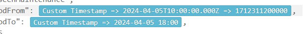
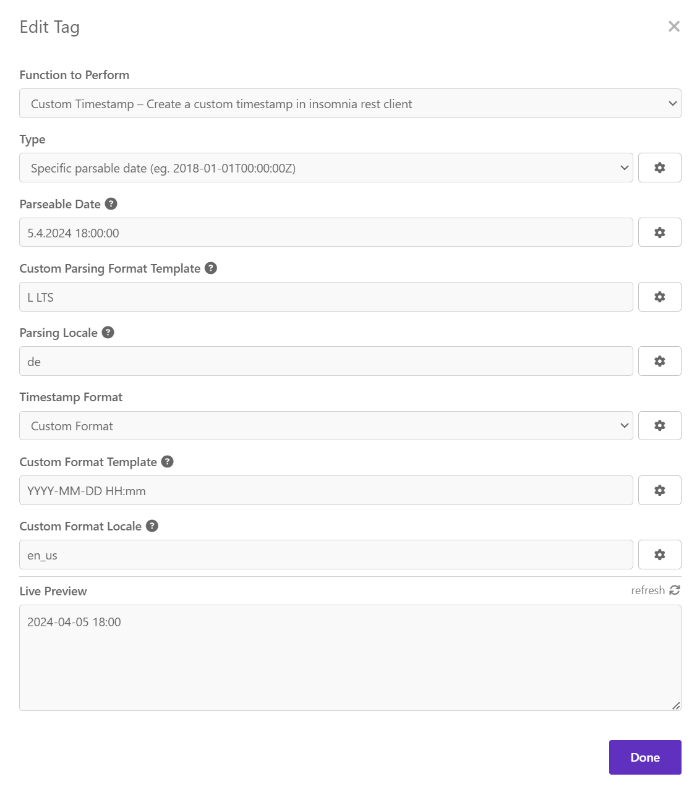

# insomnia-plugin-customtimestamp
Create a custom timestamp in insomnia rest client

## Created value is visible directly
You see a preview of the value that will be submitted. When using timestamp you will see also the iso time.

## Specific Timestamp
Self-explanatory, basic specific timestamp.

## Add/Subtract time from current time
Add 2 years 2 days to current time and then output it as you wish or even subtract 2 years from the current time.

## Use a parsable time string
Parse an isodate or even some custom parsable date time string using moments parsing functionalities.

